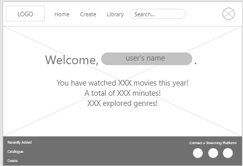
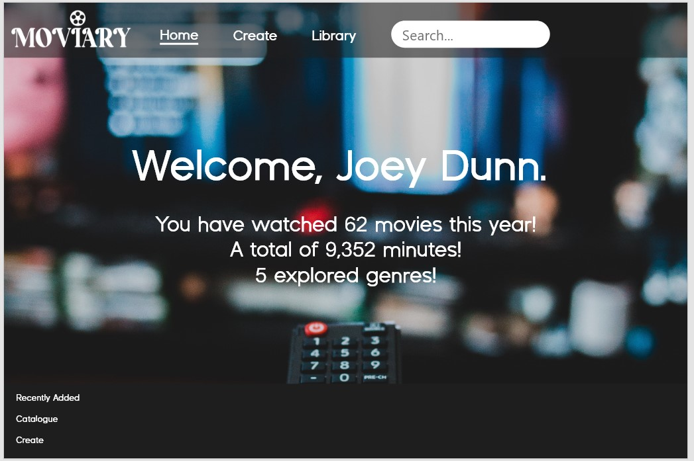
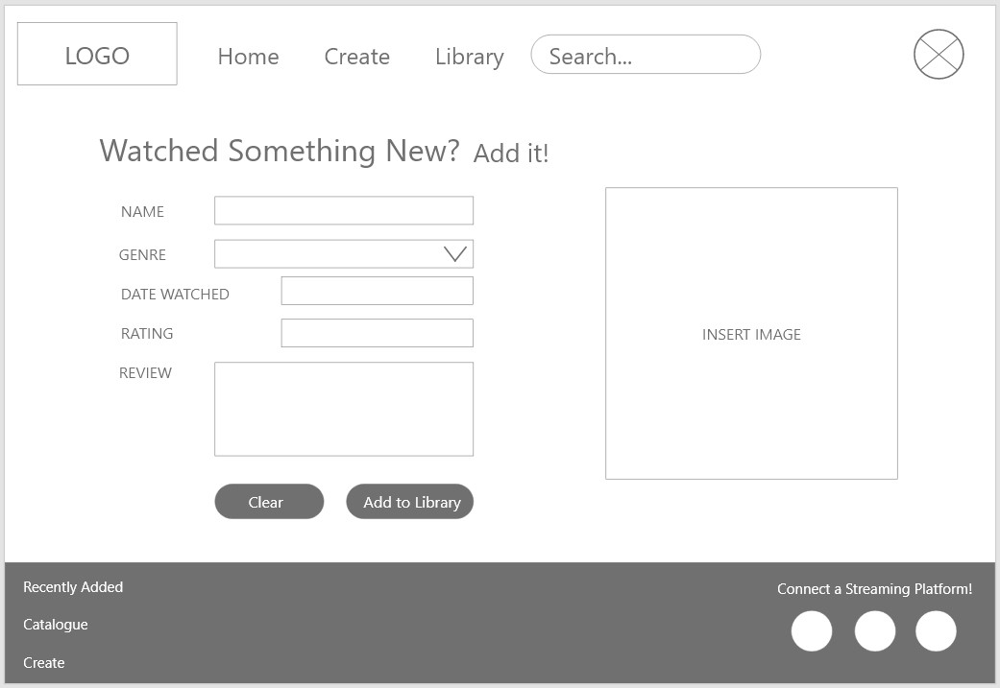
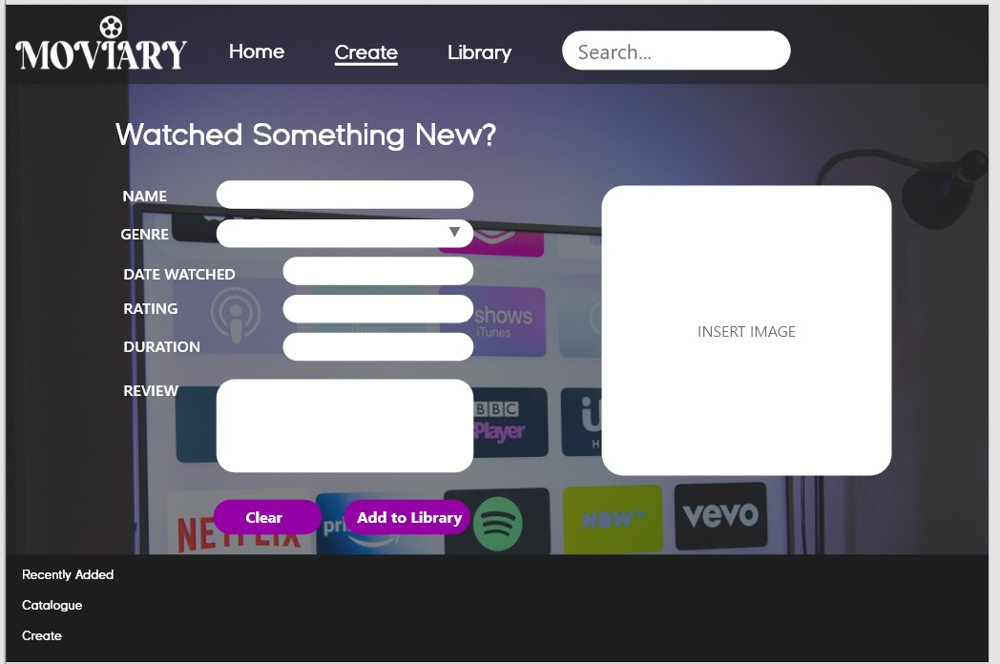
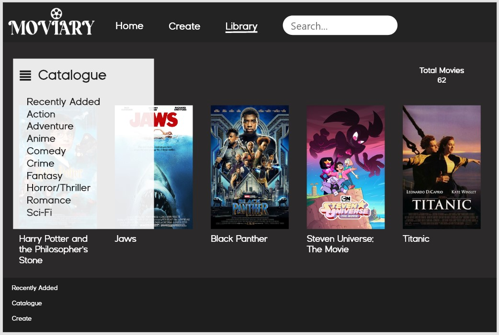

# Development Documentation

This development documentation explains the process of developing the Moviary Website Application from design mockup to prototype. It shares and demonstrates self-reflection including the challenges and changes made based on feedback.

### Home Section
>**Mockup**

>**Prototype**

The home section...

### Create Section
>**Mockup**

>**Prototype**

The create section...

### Library Section
>**Mockup**

>**Prototype**

The library section...

### Designs Across All Sections
When designing the web application...

### Coding Across All Files
When coding for each file...

### Challenges Faced
There were many challenges faced during the development of Moviary.

### References
**Coding**

-

**Images**

